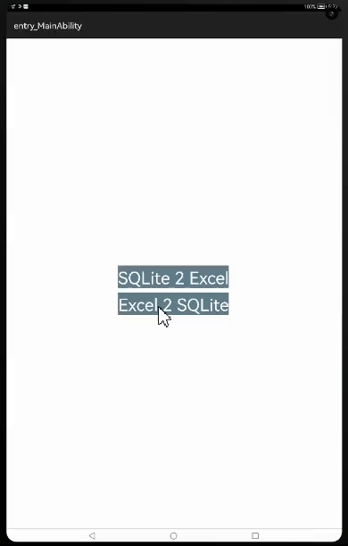

# SQLite2XL
A HMOS library to convert SQLite Database to Excel and Convert Excel to SQLite.

# Source
Inspired by [androidmads/SQLite2XL](https://github.com/androidmads/SQLite2XL) - version v1.0.2

## Features
1) This library provides user the functions to export SQLite Database to Excel and import Excel data to SQLite database.
2) This sample application has two buttons, user can choose SQLite 2 Excel and Excel 2 SQLite. 
3) When the user clicks on the button SQLite 2 Excel, user gets to add the name and phone number of a person.
4) User has to save the entered data by clicking the Save button, the data which is saved is displayed on the screen.
5) User has to click on Export button to export the data to the desired xml file.
6) Then User has to click on Excel 2 SQLite button and import the data from the xml file to database.
7) User can now click on SQLite 2 Excel to check if the data is imported.
8) Export with Exclude button will export the data to another xml file excluding the contact number entered by the user.

## Exporting from SQLite to Excel


## Importing from Excel into Database


## Dependency
1. For using library module in sample app, include the source code and add the below dependencies in entry/build.gradle to generate hap/support.har.
```groovy
dependencies {
    implementation fileTree(dir: 'libs', include: ['*.jar', '*.har'])
    implementation project(path: ':library')
    testImplementation 'junit:junit:4.13'
    ohosTestImplementation 'com.huawei.ohos.testkit:runner:1.0.0.100'
}
```
2. For using library in separate application using har file, add the har file in the entry/libs folder and add the dependencies in entry/build.gradle file.
```groovy
dependencies {
    implementation fileTree(dir: 'libs', include: ['*.har'])
    testImplementation 'junit:junit:4.13'
}
```

## Usage
## Export SQLite to Excel
This line is used to save the exported file in used preferred location.
```java
SqLiteToExcel sqliteToExcel = new SqLiteToExcel(getApplicationContext(), DbHelper.DB_NAME, directoryPath);
```

This code snippet is used to Export every table in a database to Excel Sheet
```java
sqliteToExcel.exportAllTables("users.xls", new SqLiteToExcel.ExportListener() {
    @Override
    public void onStart() {
        // Do nothing.
    }

    @Override
    public void onCompleted(String filePath) {
        Utils.showSnackBar(component, "Successfully Exported");
    }

    @Override
    public void onError(Exception e) {
        Utils.showSnackBar(component, e.getMessage());
    }
});
```

This code snippet shows how to exclude columns from the export (the resulting export file may not be able to be imported).
```java
List<String> excludeColumns = new ArrayList<>();
excludeColumns.add("contact_id");
sqliteToExcel.setExcludeColumns(excludeColumns);
...
sqliteToExcel.export...
```

This code snippet shows how to pretty names (either sheet names or column names
(the resulting export file may not be able to be imported).
```java
 Map<String, String> prettyNames = new HashMap<>();
prettyNames.put("contact_person_name", "Person Name");
prettyNames.put("contact_no", "Mobile Number");
sqliteToExcel.setPrettyNameMapping(prettyNames);
...
sqliteToExcel.export.. 
```

This code snippet shows how to format the value for a column on export.
```java
sqliteToExcel.setCustomFormatter(new SqLiteToExcel.ExportCustomFormatter() {
    @Override
    public String process(String columnName, String value) {
        String contactPersonName = "contact_person_name";
        if (columnName.equals(contactPersonName)) {
            value = "Sale";
        }
        return value;
    }
});
```

## Import Excel into Database
The following snippet is used to initialize the library for Importing Excel.
```java
ExcelToSqLite excelToSqlite = new ExcelToSqLite(getApplicationContext(), DbHelper.DB_NAME, false);
```

The following code is used to Import Excel from user directory
```java
excelToSqlite.importFromFile(directoryPath, new ExcelToSqLite.ImportListener() {
    @Override
    public void onStart() {
        // Do nothing.
    }

    @Override
    public void onCompleted(String dbName) {
        Utils.showSnackBar(component, "Excel imported into " + dbName);
    }

    @Override
    public void onError(Exception e) {
        Utils.showSnackBar(component, "Error : " + e.getMessage());
    }
});
```

## Future Work
Current sample app exports file into application data partition and also imports from the same file into database.
As an extension, Export and import can be tried with external storage paths and with customizable file paths.
                                                                                                   
## Licence
```
MIT License

Copyright (c) 2017 AndroidMad / Mushtaq M A

Permission is hereby granted, free of charge, to any person obtaining a copy of this software and associated
documentation files (the "Software"), to deal in the Software without restriction, including without limitation
the rights to use, copy, modify, merge, publish, distribute, sublicense, and/or sell copies of the Software, 
and to permit persons to whom the Software is furnished to do so, subject to the following conditions:

The above copyright notice and this permission notice shall be included in all
 copies or substantial portions of the Software.

THE SOFTWARE IS PROVIDED "AS IS", WITHOUT WARRANTY OF ANY KIND, EXPRESS OR IMPLIED, INCLUDING BUT
NOT LIMITED TO THE WARRANTIES OF MERCHANTABILITY, FITNESS FOR A PARTICULAR PURPOSE AND NONINFRINGEMENT. 
IN NO EVENT SHALL THE AUTHORS OR COPYRIGHT HOLDERS BE LIABLE FOR ANY CLAIM, DAMAGES OR OTHER LIABILITY,
WHETHER IN AN ACTION OF CONTRACT, TORT OR OTHERWISE, ARISING FROM, OUT OF OR IN CONNECTION WITH THE 
SOFTWARE OR THE USE OR OTHER DEALINGS IN THE SOFTWARE.
```                                                                                   

